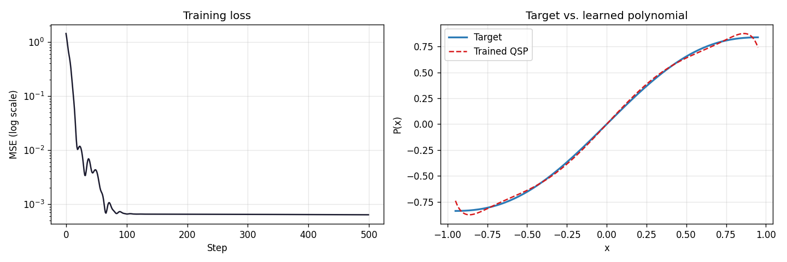

<div align="center">


**A reproducible empirical study with JAX-traceable circuits**

Research code and manuscript for learning Quantum Signal Processing (QSP) phase angles by gradient descent, a framework-agnostic method (flat differentiable circuit + JAX + Optax), with a **PennyLane reference implementation** in `qsp_jax/`.

This repository is the canonical home for the paper, reproducible experiments, notebooks, and tests. It evolved from the earlier [PennyLane community demo](https://github.com/rosspeili/qsp-pennylane-demo) but is maintained here as a standalone research project.

[](https://doi.org/10.5281/zenodo.20645403)
[](LICENSE)


</div>

---

## What This Is

Quantum Signal Processing encodes polynomial transformations of a scalar signal into a single-qubit circuit via phase-shifted oracle calls. The classical approach computes phase angles analytically from a target polynomial. This project explores the complementary route: **train phase angles from random initialization** using automatic differentiation and gradient-based optimization.

Primary contributions (current state):

- A **JAX-traceable flat QSP circuit** (avoiding high-level QSVT templates that capture concrete values and break gradients — documented first in our PennyLane reference code)
- A **reproducible degree-5 benchmark** (Chebyshev approximation of `sin(x)`) with multi-seed, scaling, and analytic baselines (PennyLane + Chao/pyqsp)
- The accompanying **manuscript** (`manuscript.tex`, self-contained via `manuscript_numbers.tex`)

See `docs/FRAMEWORKS.md` for when PennyLane is the right tool here vs. Qiskit, Cirq, TensorFlow Quantum, OpenFermion, or standalone analytic solvers.

**Audit trail:** failures, fixes, comparisons, and rationale are logged in [`docs/AUDIT_TRAIL.md`](docs/AUDIT_TRAIL.md) and [`docs/audit/LOG.jsonl`](docs/audit/LOG.jsonl). See [`CHANGELOG.md`](CHANGELOG.md) for version summaries.

---

## Quick Start

```bash
git clone https://github.com/rosspeili/trainable-qsp-angles
cd trainable-qsp-angles
py -3.13 -m pip install -r requirements.txt
py -3.13 -m pytest tests/ -v
py -3.13 -m jupyter notebook demo.ipynb
```

Regenerate figures with `demo.ipynb`, or use the committed assets below.

### Reproducible experiments

Protocol defaults: `experiments/configs/default.json`

```bash
# Single training run → results/*.json
py -3.13 -m experiments.train --seed 0 --steps 500

# Analytic baselines (PennyLane poly_to_angles + Chao/pyqsp; see docs/FRAMEWORKS.md)
py -3.13 -m experiments.baseline_analytic
py -3.13 -m experiments.baseline_analytic --backend pennylane
py -3.13 -m experiments.baseline_analytic --backend chao --chao-method laurent

# Phase 2 sweeps (use --quick for smoke tests)
py -3.13 -m experiments.sweep multi-seed
py -3.13 -m experiments.sweep scaling
py -3.13 -m experiments.sweep ablation

# Comparison table + loss curve for paper/notebooks
py -3.13 -m experiments.summarize baseline

# Regenerate hardcoded TeX figure numbers (manuscript_numbers.tex)
py -3.13 -m experiments.generate_manuscript_numbers

# Optional: legacy pgfplots .dat export (not required to compile manuscript.tex)
py -3.13 -m experiments.export_manuscript_figures

# Append an audit entry after a failed run or significant fix
py -3.13 -m experiments.audit append --category failure --status open \
  --title "..." --what "..." --why "..." --labels "tag1,tag2"
py -3.13 -m experiments.audit list --last 10
```

Analysis notebooks (after sweeps): `notebooks/01_baseline_comparison.ipynb`, `notebooks/02_scaling_study.ipynb`.

JSON outputs go to `results/` (gitignored; see `results/schema.json`). Hardcoded paper values live in `manuscript_numbers.tex` (committed).

### Build the paper

```bash
pdflatex manuscript.tex
biber manuscript
pdflatex manuscript.tex
pdflatex manuscript.tex
```

No external `.dat` files are required; figures use coordinates from `manuscript_numbers.tex`.

---

## Repository Layout

```
trainable-qsp-angles/
├── docs/
│   ├── AUDIT_TRAIL.md      # Failures, fixes, comparisons, rationale (human-readable)
│   ├── audit/
│   │   ├── LOG.jsonl       # Append-only machine audit log (committed)
│   │   └── README.md       # How to append audit entries
│   └── FRAMEWORKS.md       # Stack choices; PennyLane as ref. impl., not exclusive
├── manuscript.tex          # Paper source (self-contained figures)
├── manuscript_numbers.tex  # Hardcoded result coordinates (from results/)
├── references.bib          # Bibliography
├── experiments/
│   ├── configs/default.json
│   ├── train.py
│   ├── baseline_analytic.py
│   ├── sweep.py
│   ├── summarize.py
│   └── generate_manuscript_numbers.py
├── notebooks/
│   ├── 01_baseline_comparison.ipynb
│   └── 02_scaling_study.ipynb
├── results/                # Generated run outputs (gitignored except schema)
├── demo.ipynb              # Interactive training demo
├── target_polynomial.png   # Benchmark figure (also in demo.ipynb)
├── training_results.png
├── qsp_jax/
│   ├── baseline.py         # PennyLane poly_to_angles wrapper
│   ├── chao_baseline.py    # Standalone Chao / pyqsp Laurent completion
│   ├── convention.py       # Phase maps (pyqsp/PL -> flat circuit)
│   └── circuit.py          # Flat QSP circuit, target poly, loss
├── tests/
├── requirements.txt
├── LICENSE                 # Apache 2.0
└── NOTICE                  # Attribution requirements
```

---

## Key Concepts

- **Signal oracle**: `W(x) = H @ RZ(-2*arccos(x)) @ H`, encoding `x ∈ (-1, 1)` in the top-left matrix element
- **QSP sequence**: Flat alternating circuit — one phase rotation `RZ(-2*phi_k)` per signal query `W(x)`
- **Polynomial encoding**: The expectation value `<X>` encodes a degree-d polynomial in `x` determined by the phase angles
- **Training**: Adam (Optax) minimizes MSE between circuit output and target polynomial via `jax.grad`
- **Implementation note**: `qsp_jax/circuit.py` uses PennyLane primitives as the reference frontend; the same flat pattern applies in Qiskit, Cirq, TFQ, etc. (see `docs/FRAMEWORKS.md`)
- **JAX note**: Use inline rotations, not opaque template objects that freeze parameters at build time

---

## Target Polynomial (Default Benchmark)

The default target is a **degree-5 Chebyshev approximation of `sin(x)`** on `[-1, 1]` — an odd polynomial bounded in `[-1, 1]`, consistent with QSP conventions for odd-degree transformations. It has a maximum deviation of ~0.174 from the true `sin(x)`.


After 500 Adam steps (lr=0.05, 64-point grid), Phase 2 reference results (seed 0, from `results/paper/`):

- **Train MSE**: $9.6 \times 10^{-5}$
- **Hold-out MSE**: $1.66 \times 10^{-3}$
- **Max pointwise error**: $3.42 \times 10^{-2}$ (vs. target polynomial)
- **Mapped analytic baselines** (same flat circuit): $4.7 \times 10^{-3}$ train MSE

Multi-seed ($n=30$): median train MSE $6.3 \times 10^{-5}$; all seeds below $10^{-3}$.

**Hyperparameter ablation** (18 configs, seed 0; `results/ablation/`): learning rate $\in \{0.01, 0.05, 0.1\}$, grid $\in \{32, 64, 128\}$, init $\in \pm[0.5, 1.0]$ — all runs below $10^{-3}$ train MSE (range $3.7 \times 10^{-5}$–$1.8 \times 10^{-4}$). Default protocol is representative, not cherry-picked.

Loss drops from ~1.36 (random initialization) to ~$9.6 \times 10^{-5}$ within 500 steps.



---

## Attribution

This work is **free and open source** under [Apache 2.0](LICENSE).

If you use this repository **in whole or in part** — code, snippets, notebooks, figures, data, or the LaTeX manuscript — you **must attribute**:

> Vladimiros Peilivanidis, ARPA Hellenic Logical Systems

See [NOTICE](NOTICE) for the full attribution text and suggested citation.

**Cite:** [DOI 10.5281/zenodo.20645403](https://doi.org/10.5281/zenodo.20645403) (Zenodo) · [GitHub repository](https://github.com/rosspeili/trainable-qsp-angles)

---

## Related Work

Key references (full bibliography: [`references.bib`](references.bib)):

- Low & Chuang (2017), [Optimal Hamiltonian Simulation by QSP](https://arxiv.org/abs/1606.02685), *Phys. Rev. Lett.*
- Gilyén et al. (2019), [Quantum singular value transformation and beyond](https://arxiv.org/abs/1806.01838), STOC
- Martyn et al. (2021), [A Grand Unification of Quantum Algorithms](https://arxiv.org/abs/2105.02859), *PRX Quantum*
- Chao et al. (2020), [Finding Angles for QSP with Machine Precision](https://arxiv.org/abs/2003.02831)
- Haah (2019), [Product Decomposition of Periodic Functions in QSP](https://arxiv.org/abs/1806.10236), *Quantum*
- Cerezo et al. (2021), [Variational Quantum Algorithms](https://arxiv.org/abs/2012.09265), *Nat. Rev. Phys.*
- Bergholm et al. (2022), [PennyLane](https://arxiv.org/abs/1811.04968)

---

## License

Apache 2.0 — see [LICENSE](LICENSE) and [NOTICE](NOTICE).
